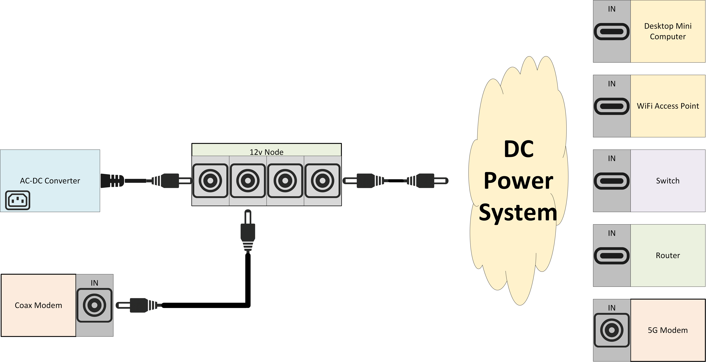

# Home Lab Network

This is my current home network lab project. The goal of this project is provide documentation and justify certain technical decisions on various approaches to implementing a network lab.

## Objective

- previous system was typical 19" server racks, which were too big and bulky for basic homelab needs
- power system needs to modular: all systems should take in DC power supplies inputs instead of AC-to-DC converters (adapters)
- common power supplies with same voltage need to be unified to reduce number of total AC outlets
- important systems should have battery backup inbetween source of power supply

### Modularity

The systems' power source should be able to change from an AC-to-DC converter for home usage or another mobile DC power supply (such as a car battery, solar panels, or mobile rechargeable battery).

#### Home Power Concept

#### Mobile Power Concept

#### Solution

- systems sold include 4U server chasis, Uinterrupted Power Supplies

#### Status

This project is onging. I started it May 2025 and as of this writing (July 2025) and currently updating it by creating documentation and diagrams of the project. I expect to have a good-enough, first draft by end of August including data connections diagram (Ethernet ports and respective RJ45 cabling), power connections diagram (12v DC cables to respective devices), and future upgrades (device upgrades and changes).

##### Power Flow Concept

This is the flow of power supply to the load devices (modems, router, switch, wifi). The purpose of this diagram is to illustrate the different connections needed to make each rack enclosure modular and unify power supplies.

##### Power Connections

This is the actual connections of each cable to the devices fixed in the exact rack enclosure.

##### Data Flow Concept

This is the flow of data to the network devices (from modems to router, switch, wifi). The purpose of this diagram is to illustrate the different devices used in each rack enclosure. Note how the first rack contains the coax modem and AC-to-DC power converter. These components are meant for stationary, home use. Whereas the other devices can be unplugged and moved around as long as power is supplied through an alternative (such as a battery or car).

##### Data Connections

## Power

This is a TBD section on power.

## Data

This is a TBD section on data.
